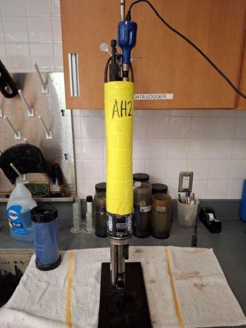
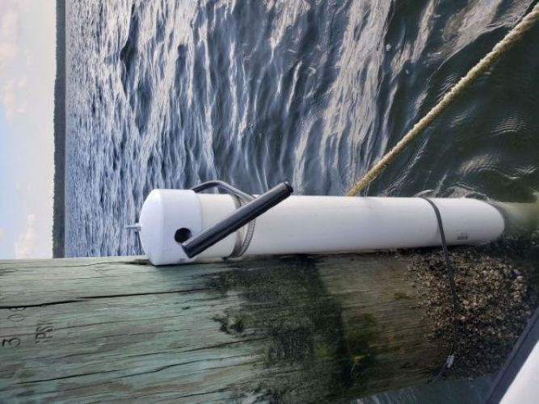
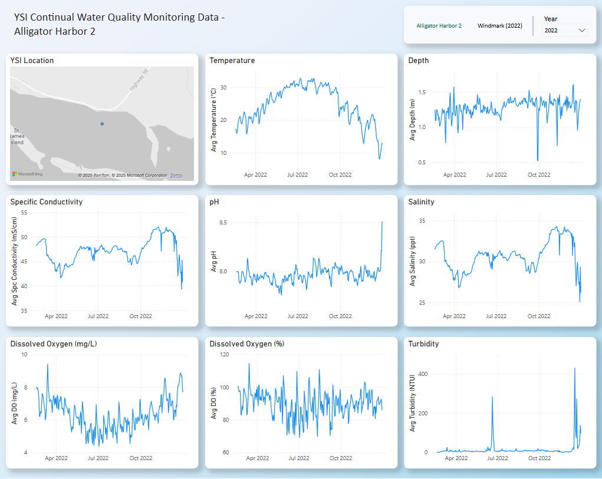

<h1 align="center">CPAP YSI Continual Water Quality Monitoring</h1>

  

## Background
The FDEP Central Panhandle Aquatic Preserves (CPAP) conducts continual water chemisty data collection through the use of YSI EXO2 data sondes. These dataloggers collect temperature, depth, specific conductivity, pH, salinity, dissolved oxygen, and turbidity data continually across 15 minute intervals at our two established stations, Alligator Harbor (designated AH2), and Windmark (designated WD).

## Why it Matters
Continuous water quality monitoring in our bays offers several key benefits, such as:

• Providing us with data necessary to make informed decisions regarding the research and restoration we conduct in these bays.  
• Preventing data gaps and anomalies that come with manual sampling.  
• Seeing how the water in our bays is responding to external factors such as changes in riverine flow and weather activity.  

This real-time data provides us with the information necessary to help guide our conservation and restoration efforts in the most effective way possible.

## How We Collect Our Data

Our data sondes are housed within a PVC pipe mounted vertically to a designated channel marker. Once a month, the dataloggers are retrieved, downloaded, cleaned, and inspected. At the same time, freshly calibrated units are deployed, minimizing or eliminating data gaps between collection intervals. Each datalogger undergoes both pre- and post-deployment calibration to ensure sensor accuracy.

Upon retrieval, the deployment data are uploaded from the YSI data sonde and go through a quality assurance/quality control (QAQC) process. During QAQC, anomalous data are reviewed to determine whether values should be flagged or rejected. Data outside the expected range for each site are evaluated using weather records, field notes, QC checks, data visualizations, and instrument diagnostics. Readings are rejected if anomalies are linked to sensor malfunction or excessive fouling. Sensor malfunctions are identified through physical inspection (e.g., damaged DO probe membrane), failure to post-calibrate, or if values fall outside the established range for that sensor.

All of our EXO2 monitoring data has been compiled into an [interactive Power BI dashboard](https://app.powerbi.com/view?r=eyJrIjoiZGUzNTIyZGMtNjhjMy00NWVmLWJmMGItMmQ3ZWZjZTkxMjY5IiwidCI6ImI2MjAxOTYwLTQ1YmEtNGI3OC1iMDgwLWYxYzQzM2ZmNmUzNiIsImMiOjZ9), which contains all observed data that has not been rejected due to anomalies in the data collection process. This dashboard provides easy access to our water quality monitoring data in a way that is accessible, while also being detailed enough to support scientific and technical analysis.

### Central Aquatic Preserves Main Page:
• [CPAP](https://matt-law12.github.io/cpap/)

### Other Projects:
• [Florida Oyster Cultch Placement Restoration Project](https://matt-law12.github.io/CPAP_NRDA_Oyster_Project/)  
• [Cat Point Living Shoreline Restoration Project](https://matt-law12.github.io/cpap_shore/)  
• [Florida Seagrass Recovery Project](https://app.powerbi.com/view?r=eyJrIjoiZjUwZDkwZTctNzdlYi00MzY0LWE2NjQtOTY0NzQ5YWJlNGVjIiwidCI6ImI2MjAxOTYwLTQ1YmEtNGI3OC1iMDgwLWYxYzQzM2ZmNmUzNiIsImMiOjZ9)  

### Data Dashboards:
• [Florida Oyster Cultch Placement Restoration Project](https://app.powerbi.com/view?r=eyJrIjoiODhhZGQxZmYtYjYzYy00MTQ0LWI3M2EtZmE3NzdlODdlOGE3IiwidCI6ImI2MjAxOTYwLTQ1YmEtNGI3OC1iMDgwLWYxYzQzM2ZmNmUzNiIsImMiOjZ9)  
• [Cat Point Living Shoreline Restoration Project](https://app.powerbi.com/view?r=eyJrIjoiZDMzNzc2ZGUtZDM5NC00NzE4LWE3ZTQtZWJkOTIyNjMxZDA5IiwidCI6ImI2MjAxOTYwLTQ1YmEtNGI3OC1iMDgwLWYxYzQzM2ZmNmUzNiIsImMiOjZ9)  
• [Florida Seagrass Recovery Project](https://app.powerbi.com/view?r=eyJrIjoiZjUwZDkwZTctNzdlYi00MzY0LWE2NjQtOTY0NzQ5YWJlNGVjIiwidCI6ImI2MjAxOTYwLTQ1YmEtNGI3OC1iMDgwLWYxYzQzM2ZmNmUzNiIsImMiOjZ9)  
• [CPAP YSI Continual Water Quality Monitoring](https://app.powerbi.com/view?r=eyJrIjoiZGUzNTIyZGMtNjhjMy00NWVmLWJmMGItMmQ3ZWZjZTkxMjY5IiwidCI6ImI2MjAxOTYwLTQ1YmEtNGI3OC1iMDgwLWYxYzQzM2ZmNmUzNiIsImMiOjZ9)  
